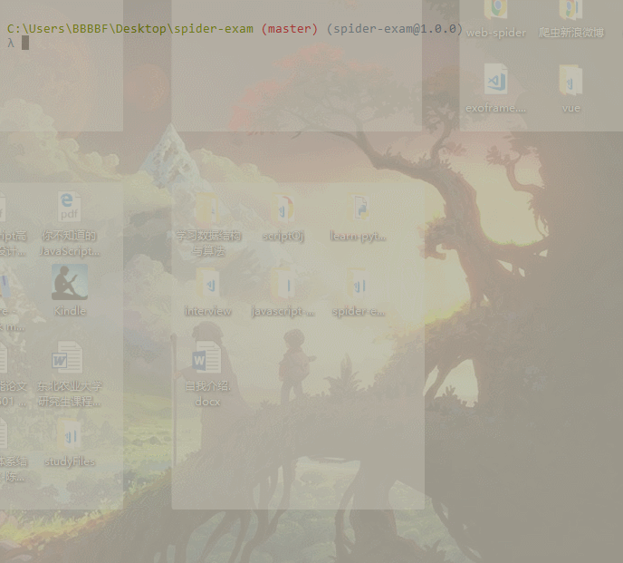

# 东北农业大学考场信息爬取程序

**项目简介：&#x1F449;**


&#x1F625;鉴于东北农业大学考场信息查询网站经常性的会非常缓慢，时不时的还会报错
&#x1F4A1;为了同学们能够稳定快速的查询考场信息
&#x1F4AA;我基于Node.js、axios、cheerio、MongoDB编写了考场信息的爬虫程序



> &#x26A0; Tips：请大家善意测试，最好是在夜深人静的时候....避免占用教务处服务器大量资源影响教务性能

## 克隆/开发

```bash
  # 克隆代码
  $ git clone https://github.com/BFjacky/spiderExams-neau.git
```

```bash
  # 目录结构
  . spiderExams-neau
  ├── assets       # README.md中用到的图像资源
  ├── src     # 源码
  ├── .gitignore  # git 忽略列表
  └── README.md   # 本说明文件
```


